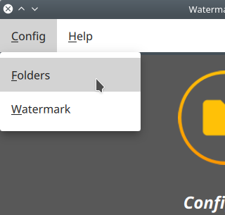

  

# Watermarker - Tool to print watermarks over images

*Copyright 2019 Carlos Enrique Pérez Sánchez.*  

-----------------------------------------------------------------------------------------------------------------------------------

## Features  
* Shows 4 images with the watermark in each corner  
* Set horizontal and/or vertical padding for the watermark image  
* Select one or more images and print them to an output folder  
* View a image in full-screen
* Remember configuration

-----------------------------------------------------------------------------------------------------------------------------------

## Usage  
The first time you open the application, you will see a window telling you to configure the input folder (where you previously copied the images), the output folder and the watermark image:  

  

You can configure all from the menu bar:  

  

  

  

Then configure the position of the watermark image from the sliders, as shown bellow. Then, you can select one or more images and click **NEXT** to continue to the next image (if any).

  

You can *Press and hold* one of the images to show it in full-screen mode, where you can flick it both horizontally and vertically to observe it in detail.

  

A progress bar bellow the menu bar indicates the progress (remaining images). Once you finish you will see the following screen (click anywhere to exit that screen and start again).

  

-----------------------------------------------------------------------------------------------------------------------------------

## Platforms
This program has been tested in **Linux** (*Ubuntu 18.04 LTS*) and **Windows** (*Windows 10 RS5*). The program should behave in MacOS in the same way it works in Linux/Windows, but I haven't tested it due to the lac of a Mac. A MacOS icon must be configured.  
This program ***can*** be compiled to mobile platforms, like Android & iOS, but I haven't designed it to fit the requirements of smartphone's screens. An alternative UI must be implemented first.  

-----------------------------------------------------------------------------------------------------------------------------------

## Build
This program uses Qt. The minimum required version is [Qt 5.12.0 LTS](https://download.qt.io/archive/qt/5.12/5.12.0/ "Qt Archive"). To build it, just open the `.pro` file in Qt Creator or execute `qmake` in the project directory:  
`$ qmake Watermarker.pro`  

-----------------------------------------------------------------------------------------------------------------------------------

## License
This program is under the *General Public License* (version 2).  

-----------------------------------------------------------------------------------------------------------------------------------

***Contact info:*** [*thecrowporation@gmail.com*](mailto:thecrowporation@gmail.com)